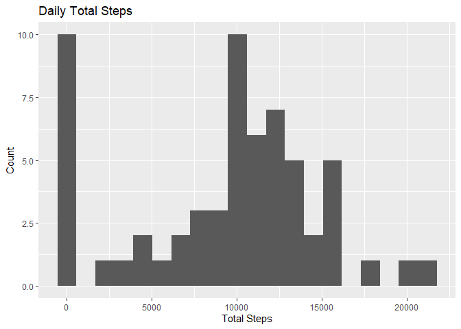

# Personal Movement Analysis of a Smart Device User


## Introduction
This document was created for an assignment in the John Hopkins Data Specialization found on Coursera.
It involves applying techniques in R to answer several questions about a provided dataset. The data consists of 2 months of measurements from a personal activity monitoring device of an anonymous individual. The measurements were taken in 5 minute intervals.


### Task 1 - Load the Data

1. Load the data (i.e. read.csv())

2. Process/transform the data (if necessary) into a format suitable for your analysis


Lets use readr from the tidyverse package to read in the csv data:


```r
library(tidyverse)
library(lubridate)
raw_data <- read_csv("activity.csv")
```

and display the first few rows..

```r
head(raw_data)
```

```
## # A tibble: 6 x 3
##   steps date       interval
##   <dbl> <date>        <dbl>
## 1    NA 2012-10-01        0
## 2    NA 2012-10-01        5
## 3    NA 2012-10-01       10
## 4    NA 2012-10-01       15
## 5    NA 2012-10-01       20
## 6    NA 2012-10-01       25
```

Lots of Na in the steps column but we won't deal with them yet as there's an imputation task later on. However, let's take a look at Na values in all columns..


```r
col_nas <- lapply(raw_data, function (x) sum(is.na(x)))
col_nas
```

```
## $steps
## [1] 2304
## 
## $date
## [1] 0
## 
## $interval
## [1] 0
```
There's no missing values in the date and interval columns so we can just remove Na values from our computations until they are imputed. 


What about the dates, are they all within a 2 month range?


```r
summary(raw_data$date)
```

```
##         Min.      1st Qu.       Median         Mean      3rd Qu.         Max. 
## "2012-10-01" "2012-10-16" "2012-10-31" "2012-10-31" "2012-11-15" "2012-11-30"
```
Well the minimum is the first of October 2012 and the maximum is the 30th of Novemeber 2012, so that's a yes.


Now the intervals are stored as numbers ranging from 0 - 2355. And once an interval reaches xx55 the next interval is x(x+1)00 (example: ...50, 55, 100, 105... ). Given this information it's safe to assume that intervals are actually stored as times: where the last two digits account for the minutes and any remaining digits are the hours at the time the interval began. We'll transform the values into a more suitable format for analysis.


Lets use the lubridate package to make working with dates easier


```r
raw_data <- raw_data %>%
  mutate(time = period(hour = (raw_data$interval - raw_data$interval %% 100) / 100,
                       minute = raw_data$interval %% 100))
```

Now let's check the steps values for errors..

```r
steps_doubles <- sum(raw_data$steps %% 1 != 0, na.rm = TRUE)
summary(raw_data$steps)
```

```
##    Min. 1st Qu.  Median    Mean 3rd Qu.    Max.    NA's 
##    0.00    0.00    0.00   37.38   12.00  806.00    2304
```
There are 0 decimal numbers and no negative values of steps which is what we would expect. Also the maximum value of 806 steps which translates to just over 2.5 steps a second seems realistic, if not a bit brisk. All in all the data looks good enough to start working with.

```r
processed_data <- raw_data
```

## Task 2 - Mean Steps per Day

1. Make a histogram of the total number of steps taken each day

2. Calculate and report the mean and median total number of steps taken per day


Firstly let's group observations by their date and look at the distribution of daily steps..


```r
daily_steps <- processed_data %>%
  group_by(date) %>%
  summarise(total_steps = sum(steps, na.rm =TRUE))

ggplot(data = daily_steps, aes(x = total_steps)) +
  geom_histogram(bins = 20) +
  labs(title = "Daily Total Steps", x = "Total Steps", y = "Count")
```

<!-- -->

Thats an interesting distribution - I wonder if they had a 10,000 step goal?


Now let's take a look at the required measures of central tendency..


```r
summary_stats <- summary(daily_steps$total_steps)
daily_median <- round(summary_stats[3])
daily_mean <- round(summary_stats[4])
summary_stats
```

```
##    Min. 1st Qu.  Median    Mean 3rd Qu.    Max. 
##       0    6778   10395    9354   12811   21194
```

So the mean is 9354 and the median is 10395. 


## Task 3 - Average Daily Pattern

1. Make a time series plot (i.e. type = "l") of the 5-minute interval (x-axis) and the average number of steps taken, averaged across all days (y-axis)

2. Which 5-minute interval, on average across all the days in the dataset, contains the maximum number of steps?


This time we need to group observations by their time and then use a line graph to see how the average number of steps changes over time.


```r
interval_averages <- processed_data %>%
  group_by(time) %>%
  summarise(mean = mean(steps, na.rm = TRUE))

ggplot(interval_averages, aes(x = period_to_seconds(time) / 3600, y = mean)) +
         geom_line() +
         labs(title = "Average number of steps throughout the day",
              x = "Time of day (hours)",
              y = "Average steps") +
              xlim(0, 24)
```

<!-- -->

Got to love that morning commute.

Now the interval with the maximum number of steps:


```r
walkiest_interval <-filter(interval_averages, mean == max(mean))
walkiest_interval
```

```
## # A tibble: 1 x 2
##   time       mean
##   <Period>  <dbl>
## 1 8H 35M 0S  206.
```
There we have it the interval starting at 8:35 is the interval with the highest average number of steps!


##Task 4 - Imputing Missing Values

1. Calculate and report the total number of missing values in the dataset (i.e. the total number of rows with NAs)

2. Devise a strategy for filling in all of the missing values in the dataset. The strategy does not need to be sophisticated. For example, you could use the mean/median for that day, or the mean for that 5-minute interval, etc.

3. Create a new dataset that is equal to the original dataset but with the missing data filled in.

4. Make a histogram of the total number of steps taken each day and Calculate and report the mean and median total number of steps taken per day. Do these values differ from the estimates from the first part of the assignment? What is the impact of imputing missing data on the estimates of the total daily number of steps?


```r
missing_values <- sum(is.na(raw_data))
missing_values
```

```
## [1] 2304
```
There are 2304 rows with missing values in the dataset.

Let's find out where these missing values are

```r
missing_time <- raw_data %>%
  filter(is.na(steps)) %>%
  group_by(interval) %>%
  summarise(count = n())
missing_time
```

```
## # A tibble: 288 x 2
##    interval count
##       <dbl> <int>
##  1        0     8
##  2        5     8
##  3       10     8
##  4       15     8
##  5       20     8
##  6       25     8
##  7       30     8
##  8       35     8
##  9       40     8
## 10       45     8
## # ... with 278 more rows
```
Looks like we might be missing 8 days..

```r
missing_days <- raw_data %>%
  filter(is.na(steps)) %>%
  group_by(date) %>%
  summarise(count = n())
missing_days
```

```
## # A tibble: 8 x 2
##   date       count
##   <date>     <int>
## 1 2012-10-01   288
## 2 2012-10-08   288
## 3 2012-11-01   288
## 4 2012-11-04   288
## 5 2012-11-09   288
## 6 2012-11-10   288
## 7 2012-11-14   288
## 8 2012-11-30   288
```
We are! 


I've decided to impute with the interval medians. The reasoning behind this is that as per the earlier exploratory analysis of variation throughout the day there is a pattern and imputing daily medians would degrade this pattern by applying a uniform distribution to 13% of the days in the dataset. I chose to use the median as it is not affected by outliers.


```r
# Get the medians for each interval
interval_medians <- raw_data %>%
  group_by(interval) %>%
  summarise(median = median(steps, na.rm = TRUE))

# match Na's with their intervals median using a left join
imputed_medians <- raw_data %>%
  filter(is.na(steps)) %>%
  left_join(interval_medians, by = "interval")

new_dataset <- read_csv("activity.csv")
# replace the Na values with the imputed medians
new_dataset[is.na(new_dataset$steps),]$steps <- imputed_medians$median

sum(is.na(new_dataset))
```

```
## [1] 0
```

No more Na!


```r
new_daily_data <- new_dataset %>%
    group_by(date) %>%
    summarise(sum = sum(steps, na.rm = TRUE))

ggplot(data = new_daily_data, aes(x = sum)) +
  geom_histogram(bins = 20) +
  labs(title = "Daily Total Steps - Imputed Data", x = "Total Steps", y = "Count")
```

<!-- -->

Here's the new datasets distribution


```r
ggplot(data = daily_steps, aes(x = total_steps)) +
  geom_histogram(bins = 20) +
  labs(title = "Daily Total Steps - Original Data", x = "Total Steps", y = "Count")
```

<!-- -->

And here's the old one. It looks a lot like the Na values were included in the original histogram as 0's. We can see that 8 days have moved up one bin from zero. There's also been a couple of other days that have changed bin... I confirmed that all the values that weren't imputed are the same as in the raw data so I'm chalking it up to a ggplot issue. It seems that using the interval medians was not a good choice, it has underestimated the number of daily steps by a large amount.


## Task 4 - Weekday/Weekend differences

1. Create a new factor variable in the dataset with two levels -- "weekday" and "weekend" indicating whether a given date is a weekday or weekend day.

2. Make a panel plot containing a time series plot (i.e. type = "l") of the 5-minute interval (x-axis) and the average number of steps taken, averaged across all weekday days or weekend days (y-axis). The plot should look something like the following, which was created using simulated data:


Creating the factor, adding it to the dataframe and making the panel plot

```r
#add the times from processed data to the new dataset to make it easier to plot
new_dataset$time = processed_data$time

new_dataset$weekend <- factor(ifelse(weekdays(new_dataset$date) %in% c("Saturday","Sunday"), "weekend", "weekday"))


ggplot(data = new_dataset, aes(x = period_to_seconds(time) / 3600, y = steps)) +
  stat_summary(fun = mean, geom = "line") +
  facet_wrap(~ weekend, nrow = 2) +
  labs(title = "Average Number of Steps Throughout the Day",
       y = "Average Steps",
       x = "Time of day (Hours)")
```

<!-- -->


  
